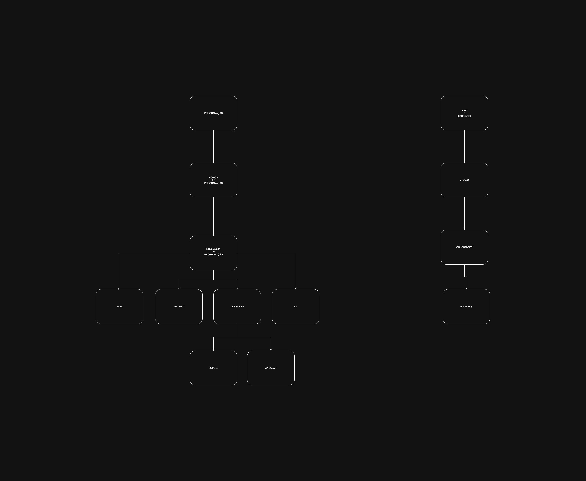
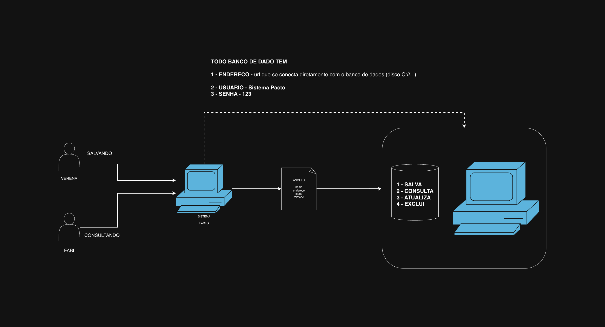
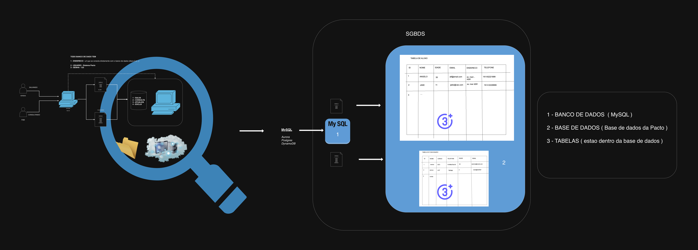

# Amendolin
## Estudos de programação da Verena

---

### Fluxograma da Programação



---

### Video como funciona logica de programção

[Logica de programação com pasta de amendoim e geléia](https://www.youtube.com/watch?v=mhGZRTbUUo8)


--- 

### Logica do Lobo, Ovelha e Repolho
- **Site Jogo**
    - [Lobo, Ovelha e Repolho](https://clubes.obmep.org.br/blog/112532-2/)

- **Problema**?
    - Tenho que atravessar o lobo, a ovelha e o repolho para o outro lado do rio.

- **Regras**
    - O lobo não pode ficar sozinho com a ovelha
    - A ovelha não pode ficar sozinha com o repolho

- **Solução**
    - ⁠pegue a ovelha
    - ⁠coloque a ovelha no barco
    - ⁠reme o barco até o outro lado do rio
    - ⁠tire a ovelha do barco
    - ⁠reme até o outro lado do rio
    - ⁠pegue o lobo
    - ⁠coloque o lobo no barco
    - ⁠reme o barco até o outro lado do rio
    - ⁠tire o lobo do barco
    - ⁠pegue a ovelha
    - ⁠coloque a ovelha no barco
    - ⁠reme o barco até o outro lado do rio
    - ⁠tire a ovelha do barco
    - ⁠pegue o repolho
    - ⁠coloque o repolho no barco
    - ⁠reme o barco até o outro lado do rio
    - ⁠pegue o repolho
    - ⁠tire o repolho do barco
    - ⁠reme o barco ate o outro lado do rio
    - ⁠pegue a ovelha
    - ⁠coloque a ovelha no barco
    - ⁠reme o barco até o outro lado do rio
    - ⁠pegue a ovelha
    - ⁠tire a ovelha do barco

- **Comparação entre Logica e Código**
- Lógica
    - ⁠pegue a ovelha
    - ⁠coloque a ovelha no barco
    - ⁠reme o barco até o outro lado do rio
    - ⁠tire a ovelha do barco
    - ⁠reme até o outro lado do rio
    - ⁠pegue o lobo
    - ⁠coloque o lobo no barco
    - ⁠reme o barco até o outro lado do rio
    - ⁠tire o lobo do barco
    - ⁠pegue a ovelha
    - ⁠coloque a ovelha no barco
    - ⁠reme o barco até o outro lado do rio
    - ⁠tire a ovelha do barco
    - ⁠pegue o repolho
    - ⁠coloque o repolho no barco
    - ⁠reme o barco até o outro lado do rio
    - ⁠pegue o repolho
    - ⁠tire o repolho do barco
    - ⁠reme o barco ate o outro lado do rio
    - ⁠pegue a ovelha
    - ⁠coloque a ovelha no barco
    - ⁠reme o barco até o outro lado do rio
    - ⁠pegue a ovelha
    - ⁠tire a ovelha do barco

- Código (angelotlin)
    - Linguagem Aleatoria
        - ovelha
        - barco(ovelha)
        - barco.remar()
        - barco.tirarAnimal(ovelha)
    - Java
        - Ovelha ovelha = new Ovelha();
        - Barco barco = new Barco(ovelha);
        - barco.remar();
        - barco.removerAnimal("ovelha");
        - barco.remar();

- **Algoritmos e Variaveis**
    - Algoritimo - Uma sequencia logica de passos a serem executados
    - Variavel - Espaço na memória para armazenarmos alguma informação

    - Exemplo
        - Padoca do Ronildo
            - Aceita apenas um tipo de pagamento
                - Dinheiro

            - Ajude o ronildo a cobrar os seus clientes corretamente!

            - Quando o cliente esta no caixa, o que deve acontecer ?
                - valor_recebido_do_cliente = 3
                - valor_total_do_produto = 10
                - valor_do_troco = ?
                - nome_do_cliente = "Werens"

            - verificar o valor do produto
            - cobrar o valor total do cliente
            - o cliente deve pagar o produto 
            - consultar o valor que o cliente esta pagando:
                
            - se o valor pago do cliente não for o valor total do produto, o que deve acontecer ?
                - não leva o produto

                - se o valor pago do cliente for igual ao valor total do produto, o que deve acontecer ?
                - leva o produto

                - se o valor pago do cliente for a mais que o valor total do produto, o que deve acontecer ?
                - dar o troco "dar_troco()"
            
            - fim
            - Obrigado por comprar comigo "nome_do_cliente"

            - dar_troco()
                - receber o valor
                - conferir o valor recebido com o valor do produto
                - valores estão preenchidos ? sim
                - se estão preenchido (recebidos) ?
                    - calcular o valor do troco
                    - valor_do_troco (vai receber) valor_recebido_do_cliente (menos) valor_total_do_produto
                    - valor_do_troco = 50 - 15
                    - valor_do_troco = 35
                - devolve valor_do_troco para cliente


- Exercicio: Black Cat School

    - Como calulcar a média do aluno para saber se ele pasou de ano ou não

        - quantidade_de_alunos = 5

        - quantidade_de_provas = 2

        - nota_prova_1 = ?
        - nota_prova_2 = ?

        - nota_final = nota_prova_1 + nota_prova_2

        - media = nota_final / quantidade_de_provas

```shell
- calcula_media_aluno(nota_prova_1, nota_prova_2)
    - caluclar a nota final
        - nota_final = nota_prova_1 + nota_prova_2
    - calcular a media
        - media = nota_final / quantidade_de_provas
    - se a media for menor que 5
        - aluno reprovado
    - se a media for maior ou igual a 5
        - aluno aprovado
    - fim
```
```shell
Jake ----------- 8, 2 ----- APROVADO -- 5
Xeroquinho ----- 3, 7 ----- APROVADO -- 5
Pinguelinho ---- 5, 10 ---- APROVADO -- 7,5
Pingo ---------- 7, 1 ----- REPROVADO - 4
Thammy --------- 10, 1 ---- APROVADO -- 5,5
```
- Aplicando o Algoritimo
    - nota_prova_1 = ?
    - nota_prova_2 = ?
    - quantidade_de_provas = quantidade_de_notas
    - quantidade_de_provas = 2


    - Como calcular as notas de todos os alunos em um unico comando ?
    - ter uma lista de alunos
        - lista_de_alunos = [
                                1 - Jake: (8,2),
                                2 - Xeroquinho: (3,7),
                                3 - Pinguelinho: (5,10),
                                4 - Pingo: (7,1),
                                5 - Thammy: (10,1),
                            ]
    - para cada aluno dentro da lista execute a tarefa chamada calcula_media_aluno ate o ultimo aluno
        - quantos alunos ha na lista ?
            - 5
        - a lista deve ser executada 5 vezes
            - calcula_media_aluno(1 n_1, n_2)
            - calcula_media_aluno(2 n_1, n_2)
            - calcula_media_aluno(3 n_1, n_2)
            - calcula_media_aluno(4 n_1, n_2)
            - calcula_media_aluno(5 n_1, n_2)
        - a lista chegou no limite maximo ?
            - sim
        - fim
    
```shell
calcula_media_aluno(nota_prova_1, nota_prova_2)
    - calcular a quantidade de provas
        - quantidade_de_provas = (qtd notas == qtd provas)
        - quantidade_de_provas = nota_prova_1 + nota_prova_2 (2 provas)
        - quantidade_de_provas = ?
    - calcular a nota final
        - nota_final = nota_prova_1 + nota_prova_2
        - nota_final = ? + ?
        - nota_final = ?
    - calcular a media
        - media = nota_final / quantidade_de_provas
        - media = ? / ?
        - media = ?

    - se a media for menor que 5
        - aluno reprovado
    - se a media for maior ou igual a 5
        - aluno aprovado
    - fim
```

- Solução Verena
```shell
nota_prova_1 = ?

nota_prova_2 = ?

quantidade_de_provas = quantidade_de_notas

quantidade_de_alunos_reprovados = Jake, Xeroquinho.

1 - Jake: (3,2), 
2 - Xeroquinho: (3,3), 
3 - Pinguelinho: (5,10)


calcula_media_aluno(nota_prova_1, nota_prova_2)
    - calcular a quantidade de provas
        - quantidade_de_provas = (qtd notas == qtd provas)
        - quantidade_de_provas = nota_prova_1 + nota_prova_2 (2 provas)
        - quantidade_de_provas = ?
    - calcular a nota final
        - nota_final = nota_prova_1 + nota_prova_2
        - nota_final = ? + ?
        - nota_final = ?
    - calcular a media
        - media = nota_final / quantidade_de_provas
        - media = ? / ?
        - media = ?

    - se a media for menor que 5
        - aluno reprovado
        - quantidade_de_aluno_reprovado = aluno
    - se a media for maior ou igual a 5
        - aluno aprovado
    - informar a quantidade de alunos reprovados 
	- verificar quantidade de alunos reprovados dentro de quantidade_de_aluno_reprovado
	- informar a quantidade de alunos reprovados
    - fim
```
--- 

### Exercício 1
```shell
Biblioteca do Ronildo

-⁠  ⁠Cadastro de nome e idade dos visitantes

-⁠  ⁠Ajude Ronildo a ter controle dos visitantes do local cadastrando nome e idade

-⁠  ⁠Vamos criar um sistema chamado cadastro_facil para ajudar o Ronildo, esse sistema irá armazenar nome e idade conforme solicitado para controle de acesso

-⁠  ⁠cadastro_facil
	- toda pessoa ao entrar na biblioteca deve se identificar com seu nome = ?
		- ao receber a resposta o sistema guarda essa informaçao como: "nome" 	
	- toda pessoa ao entrar na biblioteca deve identificar sua idade = ?
		- ao receber a resposta o sistema guarda essa informaçao como: "idade"
    - toda pessoa ao ter um cadastro concluido com sucesso ganha um numero
        - esse numero nao se repete e deve ser sequencial
            - jake - 1 ... xeroquinho - 2 ...

-cadastro_facil em execuçao:

	- qual seu nome?
	- R: Jake Matias Brown
	- qual sua idade ?
	- R: 11 anos
	- Cadastro efetuado com sucesso!
	- Acesso liberado.
    - Ganha um numero
    - Envia mensagem de bom dia
        "Bom dia "
    

    - Soulução para mensagem de bom dia
        - Repetir a mensagem pela quantidade de usuarios
            - 2 x vezes sera enviada
            - "Bom dia " + NOME
            - "Bom dia " + JAKE
            - "Bom dia " + XEROQUINHO


- [NUMERO - NOME - IDADDE]
- 1   - JAKE          -   11
- 2   - XEROQUINHO    -   7


```
--- 

### Exercício 2
```shell
Horti-Fruti do Ronildo

-⁠  ⁠Aceita tres tipos de pagamento

	- dinheiro
	- cartao de débito
	- catao de crédito

-⁠  ⁠Vamos ajudar Ronildo a cobrar seus clientes corretamente!

-⁠  ⁠Quando o cliente esta no caixa o que deve acontecer ?
	- cobrar_cliente
	- receber_valor_do_cliente
	- conferir_valor_cliente_com_o_valor_total_do_produto
	- conferir_forma_de_pagamento


-⁠  ⁠dinheiro	
	- cobrar_cliente
	- receber_valor_cliente
	- conferir_valor_cliente x valor_total_do_produto
	- valor_esta_igual
	- leva_o_produto
	- valor_esta_a_menos
	- nao_leva_o_produto
	- valor_esta_a_mais
	- verificar_necessidade_de_troco
	- dar_troco

        - dar troco
			- receber_o_valor_do_cliente
			- conferir_o_valor_recebido_com_o_valor_do_produto
			- calcular_o_valor_do_troco
			- valor_do_troco (vai receber) valor_recebido_do_cliente (menos) valor_total_do_produto
			- valor_do_troco = 20 - 10
			- valor_do_troco = 10
			- devolve valor_do_troco para cliente

-⁠  ⁠carto de débito
	- cobrar_cliente
	- receber_o_cartao_do_cliente
	- passar_o_valor_do_produto_na_maquina
	- compra_aprovada
	- leva_o_produto
	- compra_nao_aprovada
	- nao_leva_o_produto
	- nao_há_troco_pois_o_pagamento_é_exato

-⁠  ⁠carto de crédito
	- cobrar_cliente
	- receber_o_cartao_do_cliente
	- passar_o_valor_do_produto_na_maquina
	- compra_aprovada
	- leva_o_produto
	- compra_nao_aprovada
	- nao_leva_o_produto
	- nao_há_troco_pois_o_pagamento_é_exato
```
--- 

### Exercício 3
```shell
Macrameire do Ronildo

-⁠  ⁠Ronildo abriu um atelie de macrame, vamos ajuda-lo a calcular quantos metros de fio ele precisa cortar para fazer um suporte de planta em macrame.

-⁠  ⁠Para cada suporte Ronildo precisa de 4 vezes a altura final do suporte em comprimento de fio, pois é considerados os nós feitos para o acabamento.

-⁠  ⁠Como podemos ajuda-lo?

-⁠  ⁠Por exemplo:

	- O cliente pede um suporte de 1 metro de altura
	- Ronildo precisará usar 4 vezes essa altura para cortar o fio

-⁠  ⁠Vamos criar um sistema chamado calcula_fio para ajudar o Ronildo em seus calculos 

-⁠  ⁠calcula_fio

	- altura_do_suporte = 1 metro  
	- vezes_o_metro = 4
	- quantidade_de_fio_necessaria = altura_do_suporte × vezes_o_metro
	- quantidade_de_fio_necessaria = 1 × 4  
	- quantidade_de_fio_necessaria = 4 metros

-⁠  ⁠Resultado

Ronildo precisará cortar 4 metros de fio para fazer um suporte de planta de 1 metro de altura

-⁠  ⁠Mas e se Ronildo tem mais de uma encomenda, como podemos ajuda-lo a calcular?

-⁠  ⁠Por exemplo:

	- O cliente pediu cinco suportes de 1 metro de altura
	- Ronildo precisará usar 4 vezes essa altura para cortar o fio

-⁠  ⁠calcula_fio

	- fio_para_um_suporte = 1 metro × 4 = 4 metros  
	- quantidade_de_suportes = 5  
	- quantidade_de_fio_necessaria = altura_do_suporte × quatro_vezes_o_metro
	- quantidade_de_fio_necessaria = 4 metros × 5 (quantidade_de_suportes)  
	- quantidade_de_fio_necessaria = 20 metros

-⁠  ⁠Resultado

Ronildo precisará cortar 20 metros de fio para fazer 5 suportes de 1 metro cada
```
--- 

### Tipos de Dados
    - Tipo texto = "TUDO QUE ESTIVER AQUI 1234567890 !@#$%ˆ&*() É UM TEXTO"
        - char / String / text ....
    - Tipo numero = 123456789
        - number / num / int ...
    - Tipo logico = 0 ou 1 / verdadeiro ou falso / true ou false
        - boolean

    String nome = "Verena"
    String sobre_nome = "Ferreira"
    String nome_completo = nome + sobre_nome
    String nome_completo = "VerenaFerreira"

    int idade_verena = 31
    int idade_jake = 11
    int resultado = idade_verena + idade_jake
    int resultado = 42

    boolean tem_mais_de_30_anos = idade_verena é maior que 30 ? 
    boolean tem_mais_de_30_anos = idade_verena > 30 
    boolean tem_mais_de_30_anos = true

--- 

### Banco de dados SQL





--- 

### Programação Orientada a Objetos

```json
{
    "nome": "Angelo",
    "idade": 35,
    "sexo": "M",
    
    "nome": "Verena",
    "idade": 30,
    "sexo": "F"
    //...
},

// OBJETO

{
    "Pessoa": {
        "nome": "",
        "idade": 0,
        "sexo": ""
    }
}
```
```shell
pessoa.nome = Angelo
pessoa.idade = 35
pessoa.sexo = M

pessoa.nome = Verena
pessoa.idade = 32
pessoa.sexo = F

# Classe ---> Informação para a construção do objeto ( formulario )
Pessoa
    - nome
    - idade
    - sexo

# Objeto ---> A informação concreta com os dados da pessoa
    pessoa.nome = Angelo
    pessoa.idade = 35
    pessoa.sexo = M
```

```java
public class Pessoa {
	
	// Atributos de uma classe 
	
	// 1 - tipo do atributo ---> "String"
	// 2 - o nome do atributo ----> "nome"
	String nome;
	
	// 1 - tipo do atributo ---> "int"
	// 2 - o nome do atributo ----> "idade"
	int idade;
	
	// 1 - tipo do atributo ---> "String"
	// 2 - o nome do atributo ----> "sexo"
	String sexo;

}
```

```java
public static void main(String[] args){
		
		// Criando um objeto do tipo Pessoa
		// 1 - Declarar o tipo dele "Pessoa"
		// 2 - O nome desse objeto "pessoa"
		// 3 - Instancio com o tipo delcarado "= new Pessoa()"
		// 4 - P1 representa o objeto pessoa 
		
		Pessoa p1  = new Pessoa();
		p1.idade = 30;
		p1.nome = "jake";
		p1.sexo = "M";
		
		Pessoa p2 = new Pessoa();
		p2.idade = 32;
		p2.nome = "wérens";
		p2.sexo = "F";
		
		System.out.println("Essa pessoa é " + p1.nome);
		System.out.println("Essa pessoa é " + p2.nome);
		
		p1.nome = "xeroquinho";
		System.out.println("Essa pessoa é " + p1.nome);
		
    }
```

--- 